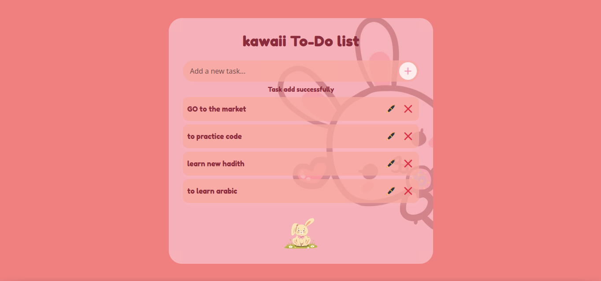

#  Kawaii To-Do List

This is a fun and cute to-do list design project assigned to us in ASTUMSJ-Bootcamp built using only **HTML and CSS**, inspired by a Figma design. The layout features soft pink tones, rounded inputs, drop shadows, and a kawaii-style font.

##  Features

- Pink theme with soft shadows
- Rounded input and button
- Center-aligned heading with cute font
- Bunny image for a fun touch
- Mobile responsive design

## Screenshot

## Reflection

- **What was easy?** Recreating the layout with HTML structure.
- **What was difficult?** Matching Figma spacing and responsiveness and centering the the plus sign.
- **Approach?** Used Flexbox and media queries for layout and responsiveness for the plus sing used absolut positioning and item-align , justify-content for centering.

