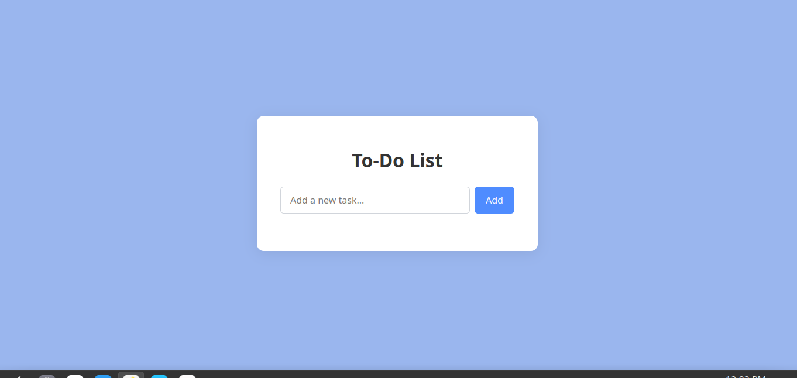

#  Simple To-Do List App

A beginner-friendly JavaScript To-Do List app that lets users add, complete, and delete tasks — with data saved in the browser using `localStorage`.

##  Features

-  Add tasks
-  Delete tasks
-  Mark tasks as completed (with a line-through)
-  Saves tasks even after refreshing (localStorage)

## Desktop Veiw

 

##  Technologies Used

- HTML
- CSS
- JavaScript 

## My Approach

I started by creating a simple HTML layout with an input, a button, and a list.
- Then I wrote JavaScript to:
  - Add new tasks to an array
  - Display tasks on the page
  - Mark tasks as done using a checkbox
  - Remove tasks with a delete button
- I used `localStorage` to save and load tasks so they stay even after the page is refreshed.
- I kept everything readable, clean, and easy to understand .

